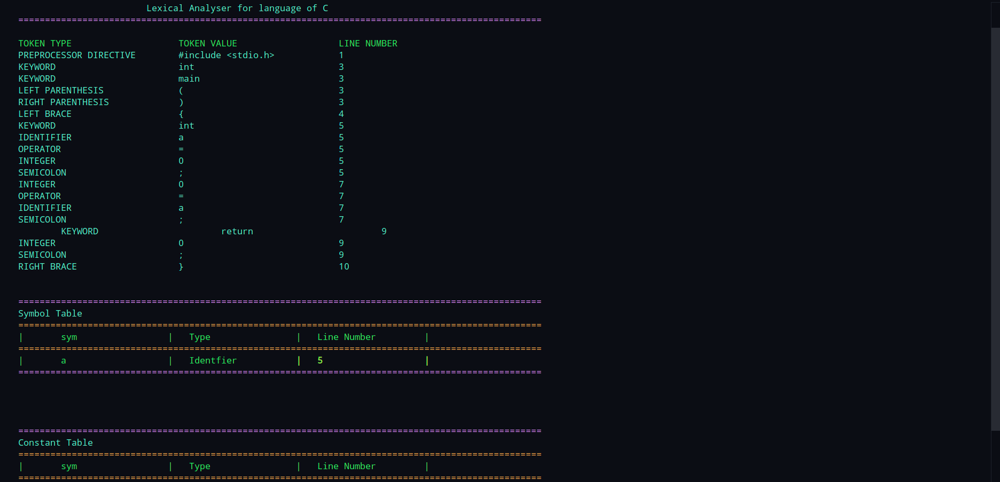
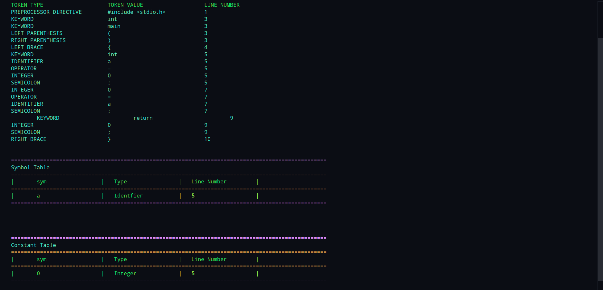
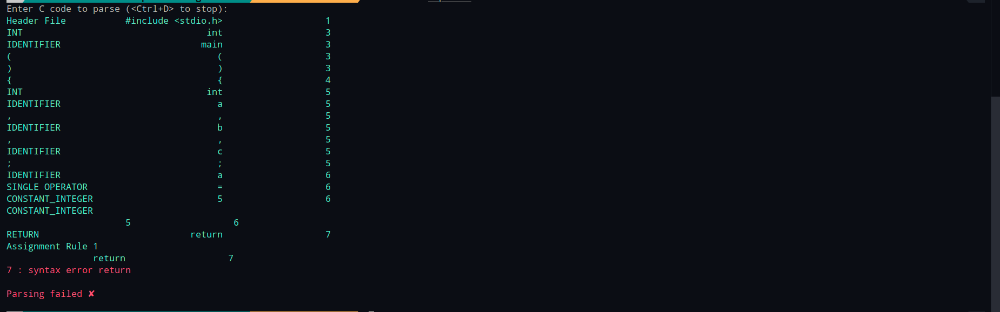

# Toy Compiler

## Introduction

A compiler is a program that translates source code written in a high-level language to machine language. Compiler design involves a series of phases. Each phase takes input from its previous stage, has its own representation of source code, and feeds its output to the next phase of the compiler. This repository contains a toy compiler project for educational purposes.


## Phases of the Compiler

### 1. Lexical Analysis

The first phase of the compiler, also known as the scanner, converts high-level programming code into tokens. The lexical analyzer reads characters from the source code and converts them into tokens, discarding whitespaces and comments.

**Input Example:**

```c
int a = 5;
float b = 3.14;
```

**Output Example:**

```
TOKEN TYPE           TOKEN VALUE         LINE NUMBER
KEYWORD              int                 1
SYMBOL               a                   1
SYMBOL               =                   1
INTEGER              5                   1
SYMBOL               ;                   1
KEYWORD              float               2
SYMBOL               b                   2
SYMBOL               =                   2
FLOATING POINT       3.14                2
SYMBOL               ;                   2
```

### 2. Syntax Analysis

The second phase of the compiler, also known as the parser, checks the syntax of the source code to ensure it follows the rules of the language. The parser generates a parse tree, which helps to understand the code structure.

**Input Example:**

```c
int a = 5;
float b = 3.14;
```

### 3. Semantic Analysis

The semantic analysis phase checks for semantic errors and ensures that the declarations and statements of the program are semantically correct.

**Input Example:**

```c
int a = 5;
float b = "hello"; // Error: Type mismatch
```

**Output Example:**

```bash
Semantic Error: Type mismatch at line 2
```

### 4. Intermediate Code Generation

This phase generates an intermediate code that is easy to translate into machine code. The intermediate code is a low-level representation of the source code.

**Input Example:**

```c
#include <stdio.h>
int return_5()
{
    return 5;
}
int main()
{
    int a = return_5();
    return 0;
}
```

**Output Example:**

```
Func return_5 begin:
Func end
Func main begin:
a = 5
Func end
```

## Running the Compiler

To run the compiler, use the provided shell scripts in each directory. For example, to run the lexical analyzer:

```bash
cd LexAnalyzer
./run.sh < input.c
```

To run the parser:

```bash
cd Parser
./run.sh < input.c
```

To run the semantic analyzer:

```bash
cd Semantic-Analyser
./run.sh < input.c
```

To run the intermediate code generator:

```bash
cd Intermediate-Code-Generator
./run.sh < input.c
```

## Conclusion

This project demonstrates the basic phases of a compiler, from lexical analysis to code generation. Each phase is implemented in a separate module, and the entire process can be run using the provided scripts.

## Images

1. Lexical Analysis
   
   

2. Parser
   
